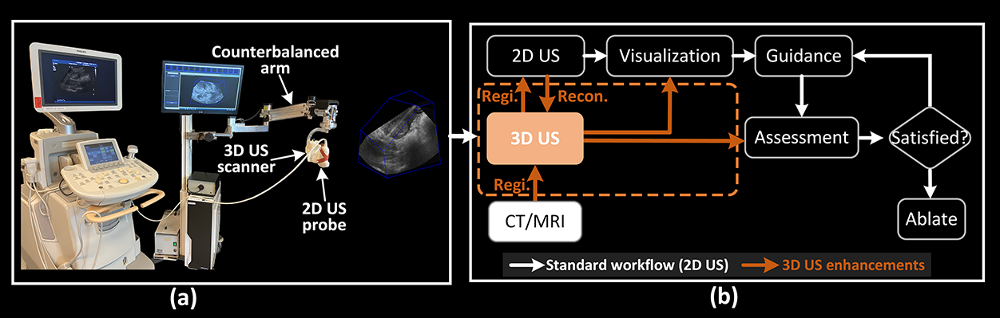

<h1>MICCAI 2025: A Novel Framework for Integrating 3D Ultrasound into Percutaneous Liver Tumour Ablation</h1>

### Overview

3D ultrasound (US) imaging has shown significant benefits in enhancing the outcomes of percutaneous liver tumour ablation. Its clinical integration is crucial for transitioning 3D US into the therapeutic domain. In this work, our contribution is to propose a novel robotic 3D US integration framework into percutaneous tumour ablation and demonstrate its clinical efficacy without disrupting standard clinical workflow. This work advanced the capabilities of 3D US imaging in improving liver tumour ablation and showed the potential to expand the therapeutic role of 3D US in clinical interventions. To the best of our knowledge, this topic has not been well discussed before.

Figure 2 illustrates the proposed framework for integrating 3D US into the standard workflow for ablation. The standard ablation workflow is enhanced with US–CT/MRI registration, multimodal visualization, and tumour coverage assessment, as highlighted in the brown block. Given our previous work on <a href="https://github.com/Xingorno/3DUS-Based-Tumor-Coverage-Evaluation-And-Optimization" target="_blank" rel= "noopener noreferrer"> tumour coverage assessment </a>, this work primarily focuses on <strong>2D US–CT/MRI registration and visualization</strong>.

  
   
  <a>Figure 1. Framework for 3D US integration into conventional 2D US guidance. (a) 3D LIVUS system; (b) intra-procedural guidance. Note: the role of 3D US is highlighted in a brown block. (Regi: registration, Recon: 3D US reconstruction)</a>

### Methods

