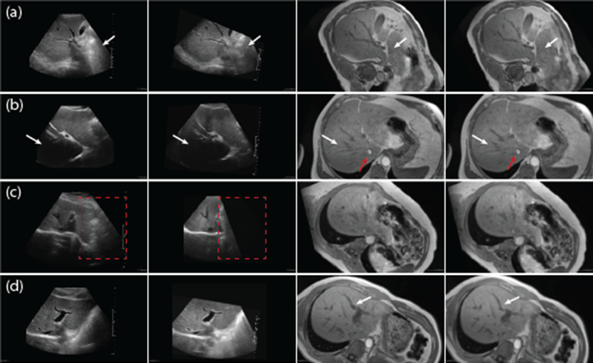

<h1>MICCAI 2025: A Novel Framework for Integrating 3D Ultrasound into Percutaneous Liver Tumour Ablation</h1>

## Overview

3D ultrasound (US) imaging has shown significant benefits in enhancing the outcomes of percutaneous liver tumour ablation. Its clinical integration is crucial for transitioning 3D US into the therapeutic domain. In this work, our contribution is to propose a novel robotic 3D US integration framework into percutaneous tumour ablation and demonstrate its clinical efficacy without disrupting standard clinical workflow. This work advanced the capabilities of 3D US imaging in improving liver tumour ablation and showed the potential to expand the therapeutic role of 3D US in clinical interventions. To the best of our knowledge, this topic has not been well discussed before.

Figure 2 illustrates the proposed framework for integrating 3D US into the standard workflow for ablation. The standard ablation workflow is enhanced with US–CT/MRI registration, multimodal visualization, and tumour coverage assessment, as highlighted in the brown block. Given our previous work on <a href="https://github.com/Xingorno/3DUS-Based-Tumor-Coverage-Evaluation-And-Optimization" target="_blank" rel= "noopener noreferrer"> tumour coverage assessment </a>, this work primarily focuses on <strong>2D US–CT/MRI registration and visualization</strong>.

  
   
  <a>Figure 1. Framework for 3D US integration into conventional 2D US guidance. (a) 3D LIVUS system; (b) intra-procedural guidance. Note: the role of 3D US is highlighted in a brown block. (Regi: registration, Recon: 3D US reconstruction)</a>

## Why Need 2D US–CT/MRI Registration and Improved Visualization?

In conventional US guidance, some liver tumours have low conspicuity or are nearly undetectable when imaging small lesions or tumours located in challenging regions, such as the liver dome (see Figure 2). In addition, tumour mimics, such as regenerative nodules and prior ablation sites, may cause further confusion, making it even more challenging for physicians to accurately identify the tumour, as shown in Figure 3. Registration of 2D US–CT/MRI is a commonly used solution, but has not seen a clinically effective one so far. In addition, checking the alignment between US and CT/MRI is always necessary for physicians to give their confidence to proceed with the treatment. How to effectively visualize multiple image modalities without adding significant workload during the procedure is a critical topic to investigate.

 
<table align="center" border="0" cellspacing="0" cellpadding="0" style="border:none !important; border-collapse:collapse !important; border-spacing:0 !important; border-top:0 !important; border-bottom:0 !important;">
  <tr>
    <td align="center" width="50%" style="border:none !important; padding:0 !important;">
        
       
      <a> Figure 2. Left: invisible tumour in US; Right: visible tumour in MRI</a>
    </td>
    <td align="center" width="50%" style="border:none !important; padding:0 !important;">
        
       
      <a> Figure 3. Left: benign regenerative nodule; Right: malignant HCC</a>
    </td>
  </tr>
</table>

## Methods 
### 2D US–CT/MRI Registration

The idea of our proposed method is to divide the direct 2D US-to-CT or MRI registration into two components, which are 3D US-to-CT or MRI registration and 2D US-to-3D US registration. This decomposition strategy could significantly reduce the computational burden for registration algorithms. In addition, the introduction of 3D US images does not increase the clinical workload complexity. The 3D US image acquisition only requires 7s-12s for a single image, and this image can also improve intra-procedure tumour coverage, as demonstrated previously. For this project, we developed a series of registration methods, including <a href="https://github.com/Xingorno/3DUS-CT-or-MRI-Rigid-Registration" target="_blank" rel= "noopener noreferrer">rigid 3D US-to-CT/MRI registration</a>, <a href="https://github.com/Xingorno/TPS-based-Interactive-Deformable-Registration" target="_blank" rel= "noopener noreferrer">deformable 3D US-to-CT/MRI registration</a> and <a href="https://github.com/Xingorno/DeepRegS2V" target="_blank" rel= "noopener noreferrer">rigid 2D-to-3D US registration</a> (see Figure 4). 

 

  
   
  <a>Figure 4. Registration overview of 2D US-to-CT/MRI images</a>

### Multimodal Image Visualization

  In this work, we introduced Multi-planar and Volume Rendering (MVR), a multimodal image visualization technique that facilitates intuitive alignment assessment. Furthermore, MVR incorporates an interactive non-rigid thin plate spline (TPS)-based registration tool for refining the alignment as needed. 

  
   
  <a>Figure 5. Different visualization approaches. (a) Alpha blending; (b) Multiplanar Reformation + rendered volume; (c) Our MVR and (d) Principle of our MVR</a>

  Here is a 3D Slicer video demo that shows how to use our developed software tool. 

 

  
   
  <a>🎬 3DLIVUS deformable registration (3D Slicer extension):  3D US-to-CT/MRI.</a>

## Results

Figure 6 shows the registration results of humans. In Figures 6a and b, regions affected by US shadowing artifacts (white arrow) were restored in the registered MRI images. Complementary liver structures, such as the inferior vena cava (red arrow), could aid procedural planning for guidance safety. Our 2D–3D US registration also achieved robust alignment in cases with limited overlap (Figure cc) and deformation (Figure 6d).

 

  
   
  <a> Figure 6. Results of US–CT/MRI registration. (For each case, from left to right: original US, 3D US MPR, rigid and non-rigid CT/MRI MPR.) </a>

 

Effective visualization is essential for delivering co-registered multimodal information to the physician during procedures. Figure 7 demonstrates how the visualization could be applied to the clinical application. During applicator guidance, a “side by side” display of real-time US images, alongside corresponding CT/MRI slices is preferred in clinical practice, as it effectively presents the complementary information from multiple modalities. In addition, 3D visualization, such as rendered CT, MRI, 3D US and spatially tracked US images, offers more intuitive information, facilitating instrument placement, liver targets localization, and an overview of the entire setup.

 

  
   
  <a> Figure 7. CT/MRI reformations and 3D visualization. (a) liver 2D US image with outlined portal vein overlayed; (b) corresponding CT slice; (c) rendered CT and tracked 2D US; and (d) rednered 3D US and tracked 2D US. </a>

